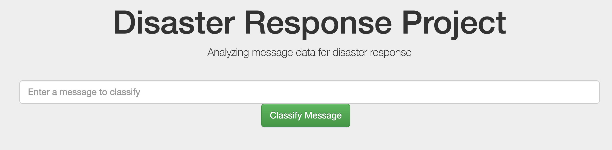
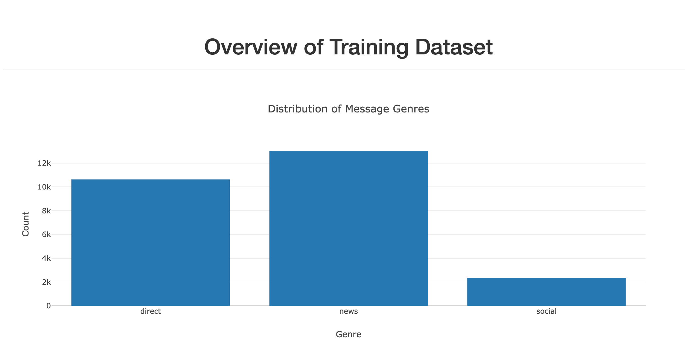

# Disaster Response Pipeline Project

<<<<<<< HEAD

=======
>>>>>>> 06a0f5301411fe81c27428356de50caad9916749
## Project Description
As part of the udacity nano degree course, this project aims to categorize text using Natural 
language Processing (NLP). The intention and motivation of the project is to classify the text 
as soon as it comes in (realtime). 

<<<<<<< HEAD

=======
>>>>>>> 06a0f5301411fe81c27428356de50caad9916749
this exercise showcases data science skills within an end to end proess. from data cleaning to deployment.
which can be summarized as below:

the project has 3 parts 
1. ETL(Extract - Transform - Load)
2. ML (machine learning)
3. Deployment 

## Installation
required to install dependencies with a minimum of python 3.6+ including the list of dependencies below:

### Dependencies 
1. nltk 
2. sqlalchemy
3. pickle
4. flask
5. plotly
6. sklearn libraries (pipeline, randomforest classifier)

### User installation
clone repo and unzip data.

run python ../app/run.py to start server 

once server is running, go to url. 0.0.0.0:3001

## Changelog
all changes are logged within this repo.

## License 

